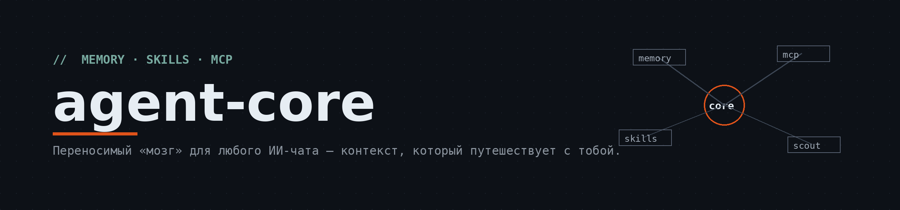

<p align="center">
  
</p>

<p align="center">
  
  
  
  
  
</p>

> **Переносимый «мозг» для ИИ-чата.** Клодишь репозиторий — и любой чат (Claude, ChatGPT,
> Cursor, Cline…) снова помнит тебя: контекст, правила и прошлые решения.

---

## Идея

Обычный чат забывает всё после закрытия вкладки. Этот репозиторий — **внешняя память
и характер** агента: один раз настроил → в любом чате он снова «твой».

```
┌──────────┐   ссылка    ┌─────────────┐   читает    ┌──────────────┐
│  ИИ-чат  │ ──────────▶ │  agent-core │ ──────────▶ │  START.md    │
└──────────┘             │  (git-репо) │             │  + memory/   │
      ▲                  └─────────────┘             │  + skills/   │
      │   после беседы          │                    └──────────────┘
      └──── дописывает ─────────┘   commit → в следующий раз мозг полнее
```

## Быстрый старт (5 минут)

1. **Сделай копию** — сделай форк этого репозитория (или просто клонируй) и назови
   по-своему, например `my-agent-brain`. Память — личная, репозиторий лучше сделать **приватным**.
2. **Заполни профиль** — `memory/user.md` и `memory/preferences.md` (агент поможет:
   он задаст 4–5 вопросов и заполнит сам).
3. **Настрой git** — имя и email для коммитов:

   ```bash
   git config --global user.name "Твоё Имя"
   git config --global user.email "you@example.com"
   ```

4. **Поставь страховку от секретов**:

   ```bash
   cp hooks/pre-commit-check.sh .git/hooks/pre-commit && chmod +x .git/hooks/pre-commit
   ```

5. **Подключай к любому чату** — одной фразой:

   > Вот мой мозг агента: `https://github.com/<ты>/<мозг>` — склонируй и работай по файлу `START.md`.

## Что внутри

| Папка / файл | Что это |
| --- | --- |
| `START.md` | пропуск: что делать, получив ссылку |
| `memory/` | кто ты, правила, решения, уроки, что сейчас (шаблоны — заполняй) |
| `skills/` | как выполнять задачи: по одному навыку в папке, открытый формат Agent Skills |
| `mcp/` | «руки»: готовые конфиги для Cline, Claude Desktop, Cursor |
| `hooks/` | защита: git-хук не пустит токены и ключи в репозиторий |
| `scripts/` | инструменты: ночное сохранение и дайджест веб-страниц |
| `templates/` | шаблоны заметок, решений и скиллов |
| `changelog.md` | журнал: что было сделано |

## Как это развивается

После каждой беседы агент дописывает новое в `memory/` и делает коммит. В следующий
раз он стартует с более полным контекстом. **Ошибки становятся уроками, уроки — навыками.**

## Безопасность

Агент — это «чат с терминалом», поэтому правила строгие:

- **Токены и секреты** живут вне репозитория (`~/.git-credentials` или переменные
  окружения). `.gitignore` + git-хук блокируют секреты прямо в момент коммита.
- **Красные линии — только с явного ОК пользователя:** удаление репо/файлов,
  force-push, смена видимости, чужие аккаунты, деньги, необратимые действия.
- **Чужие скиллы — только после проверки** чек-листом `check-before-install`:
  скилл — это не программа, а *инструкции, которым агент подчиняется*.
- **Чтение — автоматически, запись — осознанно:** любое действие, меняющее мир
  (коммит, пуш, установка), — только когда понятно, что именно меняется.

## Как расширять

- **Новый скилл** — папка `skills/<имя>/SKILL.md` (шаблон: `templates/skill-template.md`).
- **MCP** — конфиги в `mcp/configs/` для твоих клиентов, либо свой сервер.
- **Фоновые задачи** — пример: `scripts/nightly-push.sh`. Обычный скрипт, который
  расписание (cron / launchd) запускает без агента: у агента нет часов — он живёт в чате.
- Свои разделы в `memory/`, свои хуки, свои шаблоны — структура открытая.

## Важно

Агент живёт только в чате, не по расписанию. Единственное место, где память живёт
между беседами, — этот репозиторий.

---

<sub>Шаблон: форкни и сделай своим. Лицензия — MIT.</sub>
